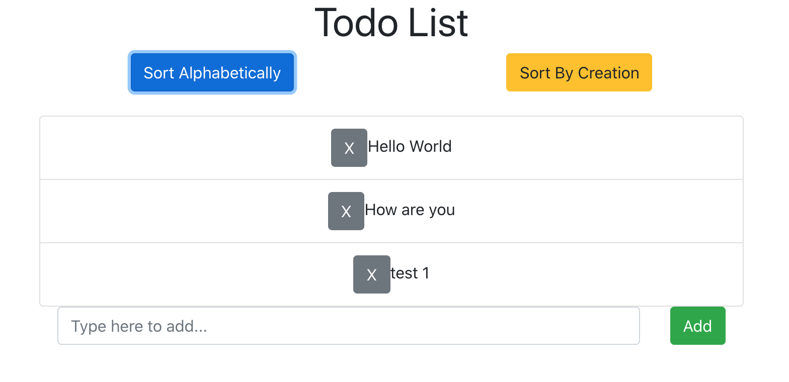

# TodoList

## About
Simple TodoList written in ReactJS using reactstrap

I wanted to make a todo list that did the following:

-Write a to-do list in React or Angular.

-Allow for users to input new items in list.

-Allow them to delete entries existing in the list.

-Have two buttons, one that sorts the list alphabetically, one that sorts by when they were entered.

-And put this in a Github repo.

This project was bootstrapped with [Create React App](https://github.com/facebook/create-react-app).

## Available Scripts

In the project directory, you can run:

### `npm start`

Runs the app in the development mode. 
Open [http://localhost:3000](http://localhost:3000) to view it in the browser.

The page will reload if you make edits. 
You will also see any lint errors in the console.

